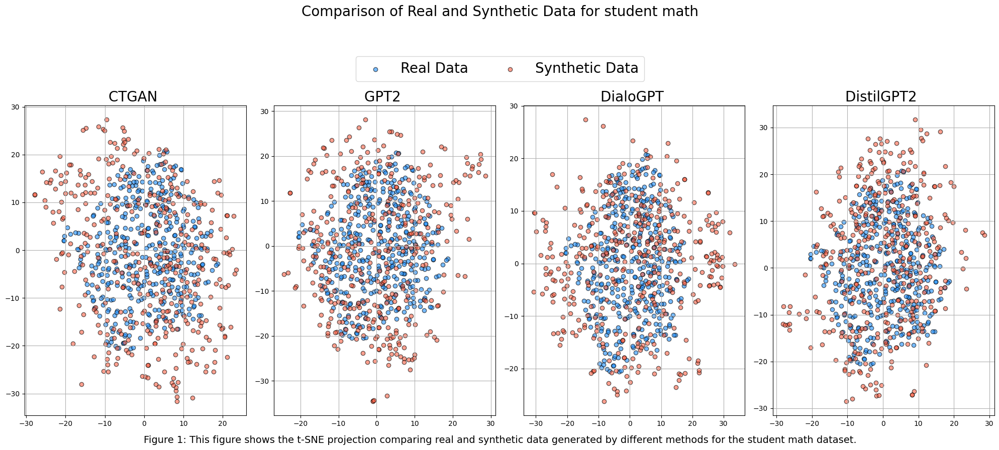
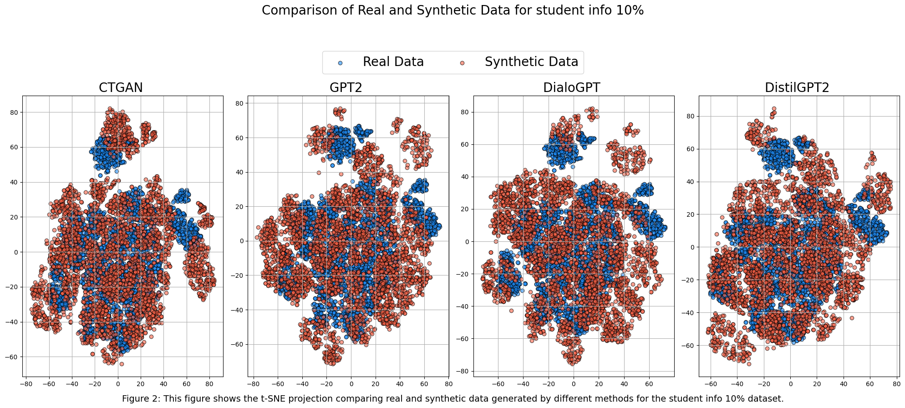
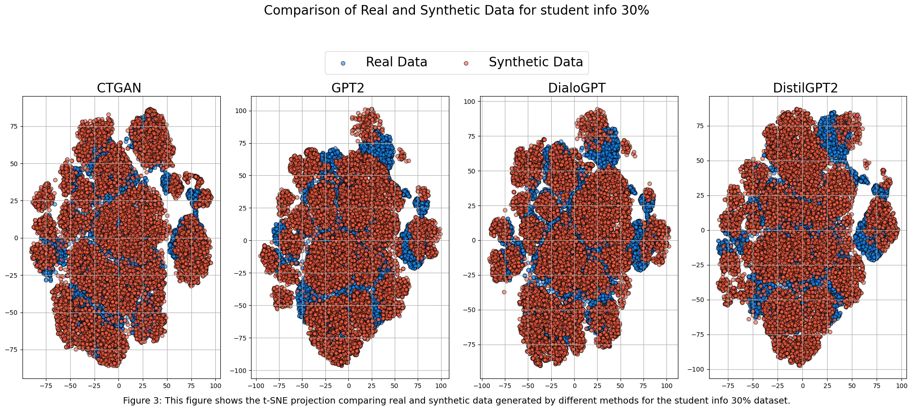
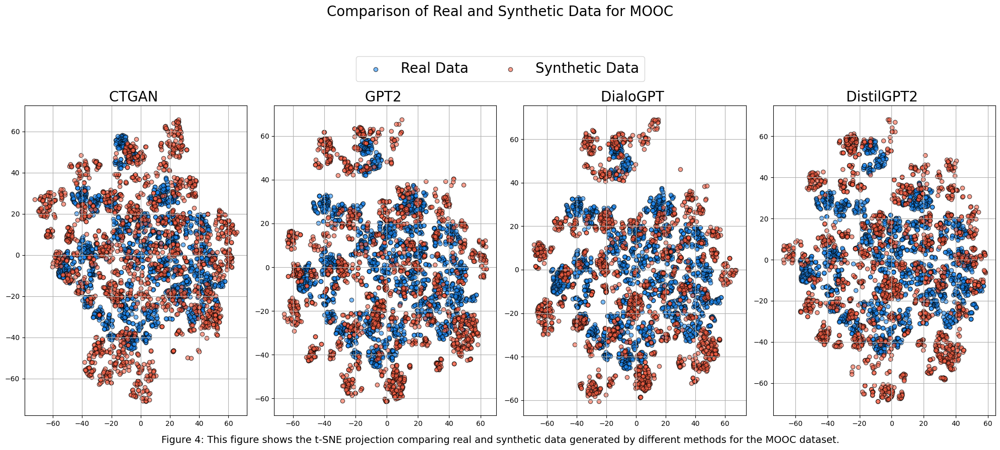
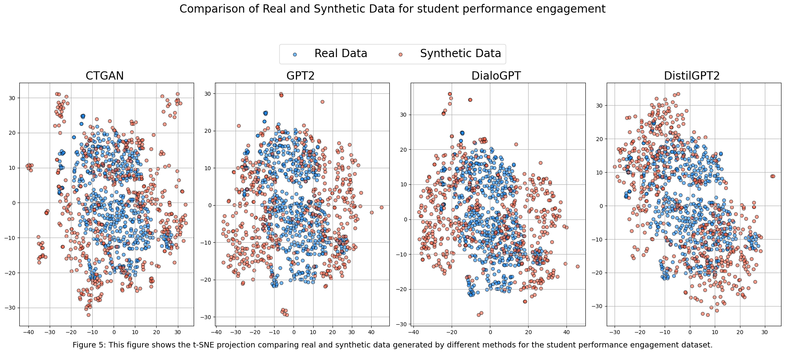
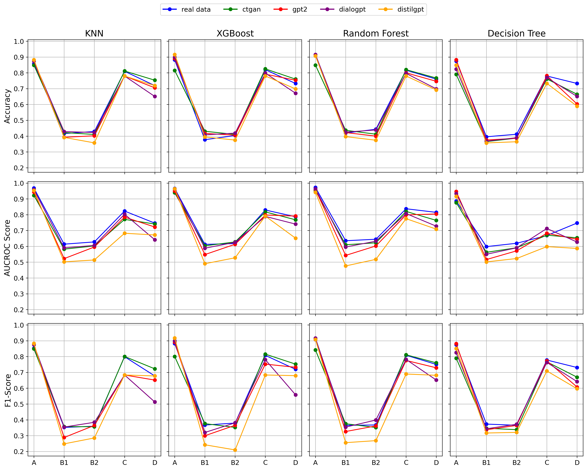

# Repository supplementary for: LAK'25 paper- Creating Artificial Students that Never Existed: Leveraging Large Language Models and CTGANs for Synthetic Data Generation
## Abstract
In this study, we explore the growing potential of AI and deep learning technologies, particularly Generative Adversarial Networks (GANs) and Large Language Models (LLMs), for generating synthetic tabular data. Access to quality students’ data is critical for advancing learning analytics, but privacy concerns and stricter data protection regulations worldwide limit their availability and usage. Synthetic data offers a promising alternative. We investigate whether synthetic data can be leveraged to create artificial students for serving learning analytics models. Using the popular GAN model- CTGAN and three LLMs- GPT2, DistilGPT2, and DialoGPT, we generate synthetic tabular student data. Our results demonstrate the strong potential of these methods to produce high-quality synthetic datasets that resemble real students’ data. To validate our findings, we apply a comprehensive set of utility evaluation metrics to assess the statistical and predictive performance of the synthetic data and compare the different generator models used, specially the performance of LLMs. Our study aims to provide the learning analytics community with valuable insights into the use of synthetic data, laying the groundwork for expanding the field’s methodological toolbox with new innovative approaches for learning analytics data generation.
### Original datasets used:
#### * DATASET A
- Name: Student performance dataset from UCI (Mathematics)
- URL: [www.archive.ics.uci.edu/dataset/320/student+performance](https://archive.ics.uci.edu/dataset/320/student+performance)
#### * DATASET B1
- Name: 10% of Open university dataset "studentinfo"
- URL: [www.nature.com/articles/sdata2017171](https://www.nature.com/articles/sdata2017171)
#### * DATASET B2
- Name: 30% of Open university dataset "studentinfo"
- URL: [www.nature.com/articles/sdata2017171](https://www.nature.com/articles/sdata2017171)
#### * DATASET C
- Name: Subset of MOOC dropout dataset
- URL: [www.ojs.aaai.org/index.php/AAAI/article/view/3825](https://ojs.aaai.org/index.php/AAAI/article/view/3825)
#### * DATASET D
- Name: Student Performance and Engagement Prediction eLearning datasets
- URL: [www.ieee-dataport.org/documents/student-performance-and-engagement-prediction-elearning-datasets](https://ieee-dataport.org/documents/student-performance-and-engagement-prediction-elearning-datasets)

### Synthetic Data Generation

All files related to synthetic data generation and evaluation are located in the ``Synthetic_Data`` folder.

#### * DATASET A
- CTGAN
    - Data: <a href="Synthetic_Data/A/CTGAN/A_ctgan_data.csv" target="_blank">Link Here</a>
    - Synthcity Evaluation: <a href="Synthetic_Data/A/CTGAN/A_ctgan_score.csv" target="_blank">Link Here</a>
- DialoGPT
    - Data: <a href="Synthetic_Data/A/DialoGPT/A_dialogpt_data.csv" target="_blank">Link Here</a>
    - Synthcity Evaluation:  <a href="Synthetic_Data/A/DialoGPT/A_dialogpt_score.csv" target="_blank">Link Here</a>
- DistilGPT2
    - Data: <a href="Synthetic_Data/A/DistilGPT2/A_distilgpt_data.csv" target="_blank">Link Here</a>
    - Synthcity Evaluation:  <a href="Synthetic_Data/A/DistilGPT2/A_distilgpt_score.csv" target="_blank">Link Here</a>
- GPT2
   - Data: <a href="Synthetic_Data/A/GPT2/A_gpt2_data.csv" target="_blank">Link Here</a>
    - Synthcity Evaluation: <a href="Synthetic_Data/A/GPT2/A_gpt2_score.csv" target="_blank">Link Here</a>
#### * DATASET B1
- CTGAN
   - Data:  <a href="Synthetic_Data/B1/CTGAN/B1_ctgan_data.csv" target="_blank">Link Here</a>
    - Synthcity Evaluation: <a href="Synthetic_Data/B1/CTGAN/B1_ctgan_score.csv" target="_blank">Link Here</a>
- DialoGPT
   - Data: <a href="Synthetic_Data/B1/DialoGPT/B1_dialogpt_data.csv" target="_blank">Link Here</a>
    - Synthcity Evaluation: <a href="Synthetic_Data/B1/DialoGPT/B1_dialogpt_score.csv" target="_blank">Link Here</a>
- DistilGPT2
   - Data: <a href="Synthetic_Data/B1/DistilGPT2/B1_distilgpt_data.csv" target="_blank">Link Here</a>
    - Synthcity Evaluation: <a href="Synthetic_Data/B1/DistilGPT2/B1_distilgpt_score.csv" target="_blank">Link Here</a>
- GPT2
   - Data: <a href="Synthetic_Data/B1/GPT2/B1_gpt2_data.csv" target="_blank">Link Here</a>
    - Synthcity Evaluation: <a href="Synthetic_Data/B1/GPT2/B1_gpt2_score.csv" target="_blank">Link Here</a>
#### * DATASET B2
- CTGAN
   - Data:  <a href="Synthetic_Data/B2/CTGAN/B2_ctgan_data.csv" target="_blank">Link Here</a>
    - Synthcity Evaluation: <a href="Synthetic_Data/B2/CTGAN/B2_ctgan_score.csv" target="_blank">Link Here</a>
- DialoGPT
   - Data: <a href="Synthetic_Data/B2/DialoGPT/B2_dialogpt_data.csv" target="_blank">Link Here</a>
    - Synthcity Evaluation: <a href="Synthetic_Data/B2/DialoGPT/B2_dialogpt_score.csv" target="_blank">Link Here</a>
- DistilGPT2
   - Data: <a href="Synthetic_Data/B2/DistilGPT2/B2_distilgpt_data.csv" target="_blank">Link Here</a>
    - Synthcity Evaluation: <a href="Synthetic_Data/B2/DistilGPT2/B2_distilgpt_score.csv" target="_blank">Link Here</a>
- GPT2
   - Data: <a href="Synthetic_Data/B2/GPT2/B2_gpt2_data.csv" target="_blank">Link Here</a>
    - Synthcity Evaluation: <a href="Synthetic_Data/B2/GPT2/B2_gpt2_score.csv" target="_blank">Link Here</a>
#### * DATASET C
- CTGAN
   - Data:  <a href="Synthetic_Data/C/CTGAN/C_ctgan_data.csv" target="_blank">Link Here</a>
    - Synthcity Evaluation: <a href="Synthetic_Data/C/CTGAN/C_ctgan_score.csv" target="_blank">Link Here</a>
- DialoGPT
   - Data: <a href="Synthetic_Data/C/DialoGPT/C_dialogpt_data.csv" target="_blank">Link Here</a>
    - Synthcity Evaluation: <a href="Synthetic_Data/C/DialoGPT/C_dialogpt_score.csv" target="_blank">Link Here</a>
- DistilGPT2
   - Data: <a href="Synthetic_Data/C/DistilGPT2/C_distilgpt_data.csv" target="_blank">Link Here</a>
    - Synthcity Evaluation: <a href="Synthetic_Data/C/DistilGPT2/C_distilgpt_score.csv" target="_blank">Link Here</a>
- GPT2
   - Data: <a href="Synthetic_Data/C/GPT2/C_gpt2_data.csv" target="_blank">Link Here</a>
    - Synthcity Evaluation: <a href="Synthetic_Data/C/GPT2/C_gpt2_score.csv" target="_blank">Link Here</a>
    
#### * DATASET D
- CTGAN
   - Data:  <a href="Synthetic_Data/D/CTGAN/D_ctgan_data.csv" target="_blank">Link Here</a>
    - Synthcity Evaluation: <a href="Synthetic_Data/D/CTGAN/D_ctgan_score.csv" target="_blank">Link Here</a>
- DialoGPT
   - Data: <a href="Synthetic_Data/D/DialoGPT/D_dialogpt_data.csv" target="_blank">Link Here</a>
    - Synthcity Evaluation: <a href="Synthetic_Data/D/DialoGPT/D_dialogpt_score.csv" target="_blank">Link Here</a>
- DistilGPT2
   - Data: <a href="Synthetic_Data/D/DistilGPT2/D_distilgpt_data.csv" target="_blank">Link Here</a>
    - Synthcity Evaluation: <a href="Synthetic_Data/D/DistilGPT2/D_distilgpt_score.csv" target="_blank">Link Here</a>
- GPT2
   - Data: <a href="Synthetic_Data/D/GPT2/D_gpt2_data.csv" target="_blank">Link Here</a>
    - Synthcity Evaluation: <a href="Synthetic_Data/D/GPT2/D_gpt2_score.csv" target="_blank">Link Here</a>

## TSNE Plots
t-SNE is a statistical method for visualising high-dimensional data, enabling clearer observation of similarities between synthetic and real data distributions [(Maaten et al., 2008)](https://www.jmlr.org/papers/volume9/vandermaaten08a/vandermaaten08a.pdf)
#### Dataset Student Math (A in the paper)

#### Dataset Student Info 10% (B1 in the paper)

#### Dataset Student Info 30% (B2 in the paper)

#### Dataset MOOC (C in the paper)

#### Dataset Student Performance and Engagement (D in the paper)

### Classifier Performance Plots
For each classifier we compare all generative models on different metrics.

### Classifier Performance Table
### Comparative Classifier Performance Table for A

| Metric       | Generator   |      KNN |   XGBoost |   Random Forest |   Decision Tree |
|:-------------|:------------|---------:|----------:|----------------:|----------------:|
| Accuracy     | real data   | 0.857143 |  0.882353 |        0.907563 |        0.87395  |
| Accuracy     | ctgan       | 0.848739 |  0.815126 |        0.848739 |        0.789916 |
| Accuracy     | gpt2        | 0.87395  |  0.890756 |        0.907563 |        0.882353 |
| Accuracy     | dialogpt    | 0.87395  |  0.89916  |        0.915966 |        0.823529 |
| Accuracy     | distilgpt   | 0.882353 |  0.915966 |        0.907563 |        0.848739 |
| AUCROC Score | real data   | 0.967987 |  0.965902 |        0.972007 |        0.88654  |
| AUCROC Score | ctgan       | 0.921531 |  0.938952 |        0.952055 |        0.876266 |
| AUCROC Score | gpt2        | 0.94327  |  0.94997  |        0.959797 |        0.946397 |
| AUCROC Score | dialogpt    | 0.958755 |  0.96218  |        0.963073 |        0.932996 |
| AUCROC Score | distilgpt   | 0.952948 |  0.964413 |        0.941632 |        0.916319 |
| F1-Score     | real data   | 0.852447 |  0.882353 |        0.90737  |        0.874618 |
| F1-Score     | ctgan       | 0.849298 |  0.800586 |        0.841782 |        0.789476 |
| F1-Score     | gpt2        | 0.875425 |  0.891335 |        0.908503 |        0.881841 |
| F1-Score     | dialogpt    | 0.874618 |  0.89984  |        0.916534 |        0.824949 |
| F1-Score     | distilgpt   | 0.883649 |  0.916892 |        0.908503 |        0.850693 |

### Comparative Classifier Performance Table for B1

| Metric       | Generator   |      KNN |   XGBoost |   Random Forest |   Decision Tree |
|:-------------|:------------|---------:|----------:|----------------:|----------------:|
| Accuracy     | real data   | 0.416155 |  0.377301 |        0.419223 |        0.395706 |
| Accuracy     | ctgan       | 0.42229  |  0.43047  |        0.436605 |        0.365031 |
| Accuracy     | gpt2        | 0.392638 |  0.417178 |        0.42229  |        0.375256 |
| Accuracy     | dialogpt    | 0.428425 |  0.407975 |        0.425358 |        0.368098 |
| Accuracy     | distilgpt   | 0.391616 |  0.394683 |        0.396728 |        0.356851 |
| AUCROC Score | real data   | 0.613814 |  0.612389 |        0.635501 |        0.598233 |
| AUCROC Score | ctgan       | 0.58236  |  0.603357 |        0.610129 |        0.562221 |
| AUCROC Score | gpt2        | 0.522349 |  0.547948 |        0.542626 |        0.516525 |
| AUCROC Score | dialogpt    | 0.590567 |  0.588339 |        0.595531 |        0.549954 |
| AUCROC Score | distilgpt   | 0.501744 |  0.490157 |        0.476052 |        0.501563 |
| F1-Score     | real data   | 0.351951 |  0.367105 |        0.365307 |        0.37315  |
| F1-Score     | ctgan       | 0.357013 |  0.376029 |        0.375382 |        0.346477 |
| F1-Score     | gpt2        | 0.288207 |  0.299563 |        0.326112 |        0.337293 |
| F1-Score     | dialogpt    | 0.354322 |  0.320153 |        0.354145 |        0.343423 |
| F1-Score     | distilgpt   | 0.248169 |  0.24224  |        0.255647 |        0.316683 |

### Comparative Classifier Performance Table for B2

| Metric       | Generator   |      KNN |   XGBoost |   Random Forest |   Decision Tree |
|:-------------|:------------|---------:|----------:|----------------:|----------------:|
| Accuracy     | real data   | 0.429107 |  0.403545 |        0.443422 |        0.411725 |
| Accuracy     | ctgan       | 0.410361 |  0.410702 |        0.412065 |        0.387185 |
| Accuracy     | gpt2        | 0.40184  |  0.40559  |        0.399796 |        0.386162 |
| Accuracy     | dialogpt    | 0.422972 |  0.418882 |        0.43865  |        0.389911 |
| Accuracy     | distilgpt   | 0.357192 |  0.374915 |        0.373892 |        0.364349 |
| AUCROC Score | real data   | 0.627992 |  0.617639 |        0.644925 |        0.619403 |
| AUCROC Score | ctgan       | 0.602559 |  0.627863 |        0.622271 |        0.591003 |
| AUCROC Score | gpt2        | 0.595855 |  0.613216 |        0.602472 |        0.571533 |
| AUCROC Score | dialogpt    | 0.605751 |  0.625447 |        0.632719 |        0.590445 |
| AUCROC Score | distilgpt   | 0.513927 |  0.527637 |        0.517719 |        0.522992 |
| F1-Score     | real data   | 0.359742 |  0.379583 |        0.36745  |        0.365588 |
| F1-Score     | ctgan       | 0.356394 |  0.351997 |        0.351555 |        0.338057 |
| F1-Score     | gpt2        | 0.364895 |  0.365635 |        0.361587 |        0.364573 |
| F1-Score     | dialogpt    | 0.384425 |  0.381049 |        0.39871  |        0.371998 |
| F1-Score     | distilgpt   | 0.285431 |  0.209777 |        0.268481 |        0.320741 |

### Comparative Classifier Performance Table for C

| Metric       | Generator   |      KNN |   XGBoost |   Random Forest |   Decision Tree |
|:-------------|:------------|---------:|----------:|----------------:|----------------:|
| Accuracy     | real data   | 0.81     |  0.82     |        0.816667 |        0.78     |
| Accuracy     | ctgan       | 0.811667 |  0.825    |        0.82     |        0.761667 |
| Accuracy     | gpt2        | 0.78     |  0.791667 |        0.8      |        0.781667 |
| Accuracy     | dialogpt    | 0.78     |  0.798333 |        0.796667 |        0.77     |
| Accuracy     | distilgpt   | 0.78     |  0.78     |        0.78     |        0.733333 |
| AUCROC Score | real data   | 0.823159 |  0.82974  |        0.837574 |        0.668407 |
| AUCROC Score | ctgan       | 0.770469 |  0.817826 |        0.820901 |        0.670689 |
| AUCROC Score | gpt2        | 0.784811 |  0.797875 |        0.798935 |        0.682765 |
| AUCROC Score | dialogpt    | 0.803046 |  0.789287 |        0.807304 |        0.712963 |
| AUCROC Score | distilgpt   | 0.682765 |  0.791254 |        0.774872 |        0.598291 |
| F1-Score     | real data   | 0.799286 |  0.807617 |        0.808453 |        0.778142 |
| F1-Score     | ctgan       | 0.800669 |  0.81548  |        0.811257 |        0.766672 |
| F1-Score     | gpt2        | 0.683596 |  0.752384 |        0.775519 |        0.773087 |
| F1-Score     | dialogpt    | 0.683596 |  0.780369 |        0.781798 |        0.76298  |
| F1-Score     | distilgpt   | 0.683596 |  0.683596 |        0.689704 |        0.708942 |

### Comparative Classifier Performance Table for D

| Metric       | Generator   |      KNN |   XGBoost |   Random Forest |   Decision Tree |
|:-------------|:------------|---------:|----------:|----------------:|----------------:|
| Accuracy     | real data   | 0.719178 |  0.732877 |        0.760274 |        0.732877 |
| Accuracy     | ctgan       | 0.753425 |  0.760274 |        0.767123 |        0.664384 |
| Accuracy     | gpt2        | 0.705479 |  0.753425 |        0.746575 |        0.60274  |
| Accuracy     | dialogpt    | 0.650685 |  0.671233 |        0.69863  |        0.650685 |
| Accuracy     | distilgpt   | 0.719178 |  0.69863  |        0.691781 |        0.589041 |
| AUCROC Score | real data   | 0.746852 |  0.786997 |        0.814861 |        0.747472 |
| AUCROC Score | ctgan       | 0.74128  |  0.767802 |        0.763983 |        0.653767 |
| AUCROC Score | gpt2        | 0.722188 |  0.791538 |        0.804747 |        0.644376 |
| AUCROC Score | dialogpt    | 0.641692 |  0.74066  |        0.727348 |        0.627038 |
| AUCROC Score | distilgpt   | 0.671827 |  0.6516   |        0.708772 |        0.586894 |
| F1-Score     | real data   | 0.677568 |  0.719622 |        0.750442 |        0.730905 |
| F1-Score     | ctgan       | 0.72261  |  0.752345 |        0.760289 |        0.669646 |
| F1-Score     | gpt2        | 0.65146  |  0.732315 |        0.729088 |        0.607298 |
| F1-Score     | dialogpt    | 0.512988 |  0.558267 |        0.651466 |        0.641682 |
| F1-Score     | distilgpt   | 0.677568 |  0.679381 |        0.681586 |        0.596818 |

